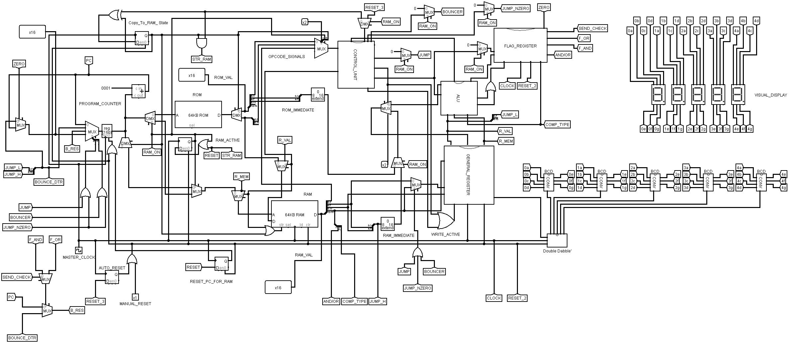

# 16-bit-CPU with Custom Assembly Language

A functioning 16-BIT unisigned CPU made in Logisim with visual display for output of numerical calculations. Supports complex jumping, bitwise operations with custom assembly language writing

  <h2>Table of Contents</h2>
  <ul>
    <li><a href="#section1">Breakdown</a>
      <ul>
        <li><a href="#purpose">Purpose</a></li>
        <li><a href="#pipeline">Pipeline</a></li>
        <li><a href="#limitations">Limitations</a></li>
      </ul>
    </li>
    <li><a href="#section2">Instruction Set</a>
      <ul>
        <li><a href="#opcodes">Table of Opcodes</a></li>
        <li><a href="#parameters">Compound Opcode Complexity</a></li>
        <li><a href="#parameters">Example programs</a></li>
        <li><a href="#creating">Custom Assembly Language</a></li>
      </ul>
    </li>
  </ul>

  <h3 id="purpose">Purpose</h3>
  
The CPU design is developed entirely in Logisim: <a = "https://sourceforge.net/projects/circuit/"><b>Click here to download the latest version</b></a>

   
  
This repository provides a detailed look into the development for a 16-bit unsigned CPU. The idea is to teach people about the fundamentals of hardware development, in addition to showcasing assembly to machine code conversion, which tends to be overlooked by most CS graduates. The repository will take a look at:

  <ul>
    <li>The different opcodes a CPU might use</li>
    <li>The pipeline of a CPU including: </li>
    <ul>
      <li>ROM to RAM parallel storage similar to the Harvards System</li>
      <li>Double Dabble algorithm to convert Binary to Binary Coded Decimal <b>BCD</b></li>
      <li>How jumping works within CPU architecture, and more importantly, how it works with limited opcode space</li>
      <li>How to generate immediate value storage</li>
      <li>A look into ALU, General Register and Flag Register design</li>
      <li>How to develop a control unit</li>
    </ul>
    <li>How to create an assembly language to write programs in human readable and not machine code (screw that!)</li>
    <li>How to display data, and different clock speeds to manage complex algorithms such as Double Dabble</li>
  </ul>

   

  
<b>Hopefully you learn something, and feel free to download the CPU in full. If you're uploading it to people, please provide me credit, but otherwise, rip it to shreds and learn as much as you can!</b>

  

  <h3 id="pipeline">Pipeline</h3>

  

   

  

  
<b>NOTE!</b>Hopefully with time, this README will cover every aspect of this image, as the complexity can seem incredibly daunting, but with adequate knowledge of each component, the process of CPU design is learnable. While this document will not go over what multiplexers are, demultiplexers, tunnels, bus's, sub-circuits, spillters, and the basics of Logisim, I will try my best to go over the abstractable concepts of what exactly the CPU needs

  

   
  
  <h4><b>Program Counter (PC)</b></h4>

  

  
<b>It all begins with a clock. MASTER_CLOCK ticks, incrementing the entire CPU's pipeline by one iteration based on a High/Low frequency shift. On the positive tick, the following occurs:</b>

  <ol>
    <li>A signal is sent to the general register to activate its ability to have a value written to it (the box with 000 to the right of MUX)</li>
    <li>The MUX -> multiplexer to its left, takes in four values, with the choice of 4 values decided by a selector -> The JUMP/BOUNCE/JUMP_NZERO opcodes./b>:</li>
    <ul>
      <li>When JUMP/BOUNCE/JUMP_NZERO are all 0, the selector value is -> 00. Thus, the program counter sends a value to the incrementer (box with cin/cout), and increments the PC's current value (lets say 12), by 1 -> (how by one? The constant 0001 is sent through) This gets fed back into the general register, and increments the ROM for later </li>
      <li>When JUMP is true, the selector value is -> 01. Thus, the program counter will simply send through the 16-bit jump address that shifts the RAM memory to a different location. (RAM at memory location 12? jump address is 1? Program Counter becomes 0001!)</li>
      <li>When Bouncer is true, the selector value is -> 10. Thus, the program counter will check whether a previous Comparison yielded true or false (Think if/while loop conditions). If true, it jumps the program counter to a memory location, else (if/while loop ends), it switch's back to the default 00's single increment logic</li>
      <li>When JUMP_NZERO is true, the selector value is -> 11. (Note: This can be seen by the two or gates to the right of JUMP/BOUNCER/JUMP_NZERO, setting both results to true in this case). Here, the program will check if a zero flag is set to true. If so, then a for loop has just ended (think for i less than size, where i is now 10 and size is 10), else it defaults to single 00 increment</li>
    </ul>
    <li>Finally, the new PC count is sent to either the ROM or RAM, and thus the next memory location in either is sent out to be processed by the CPU!</li>
  </ol>

   

  <h4><b>Read Only Memory (ROM)</b></h4>

  

  
<b>The ROM stores the startup of a program. If you also don't have a harddrive, it can be used to store programs which get fed into the RAM. Each ROM gets sent instructions -> Calculate fibonacci, where the first and last instructions are always a COPY. When COPY is first reached (Start of ROM), it tells the program to copy all of the ROM into the RAM to run the program, once the second COPY is reached (end of ROM), it sets RAM active to true, and the PC NOW points to the RAM to increment that. </b>

   
<b>Notice the seperating splitters after the instruction is outputted at "D"?</b> This is because 16-bit instructions are split into usually 4 thingsL

   <ol>
     <li>4 bit opcodes: Can very from 3 to 4 to 5. It stores the opcodes which are the instructions to tell the CPU what it is going to do with THIS 16-bit memory. E.g., do an ADD calculation, do JUMP, perhaps a Comparison?</li>
     <li>The next 8 bits will either hold an immediate value -> Value from 0 to 255 stored directly in ROM. Or two 4 bit-s -> Points tow one of the 16 bit general register which hold a specific immediate or internally calculated value from two initial immediate values</li>
     <li>The last 4 bits vary depending on opcodes, usually it specifys a general register to store a calculated ALU value, but a breakdown of this CPU's opcodes will go into greater depth on how this occurs</li>
   </ol>

   
  
  <h4><b>Random Access Memory (RAM)</b></h4>

   

   
<b>Why ROM and RAM? ROM does not allow writing to memory. In order to store values back into ROM and create a program that can run indefinatley and be useful, the ROM's data has to be sent to RAM for RAM to process each memory instruction. It uses the same splitter functionality like ROM, with the additive of an input "D" that alows the CPU to WRITE to an empty memory addres</b>

   
  
  <h4><b>RAM Check</b></h4>

   

  <ul>
    <li>The single green 0 indicates a D Flop -> Like a general register, but only storing a single bit 1/0 -> True/False.</li>
    <li>When the ROM has triggered its second COPY opcode, it sends a signal to this D Flip Flip, turning it to 1. This causes the PC to re-direct its memory location check to RAM. It also resets the PC to 0 (so the RAM can start from its first memory register index)</li>
  </ul>

    

  <h4><b>COPY</b></h4>

   

    

   
<b>Here we can see an active signal from the COPY opcode (More on the output singals from Control Unit later) When it becomes true, it sets the ROM to copy its contents over to RAM. When off, it means that it will be sent to the rest of the CPU. The RAM_ON D Flip's 1/true signal as stated before, is sent through, and if so, instead resets the entire program when RAM reach's the copy instead.</b>

  <h4><b>Control Unit (CU)</b></h4>

   

    

   <ul>
     <li>Remember the 4 bit opcode extracted from ROM/RAM? This is where it is analysed to determine which CPU operation to preform!</li>
     <li>Based on AND gates and those little circles (reverses signal to simulate different 1 and 0 combinations and thus one of the 16 opcodes) it will trigger one of the output 's on the right hand side. In this case: COPY</li>
     <li>If the opcode is from 0-9, it will NOT trigger one of the outputs, but instead activate ALU_RUN. This tells the ALU that a calculation needs to take place. It also sends out an ALUOP, which will be used again to determine which ALU operation takes place</li>
     <li><b>For more details on what each opcode does, head to the instruction set section!</b></li>
   </ul>

  <h4><b>Flag Register (FR)</b></h4>

   

    

   <ul>
     <li>The Flag register does not store traditional data, but results of particular single bit results from the ALU. Such as:</li>
     <ul>
       <li>Comparisons -> 120 = 120 -> Outputs true/1 </li>
       <li>Overflow. Number bigger than 2^16 (65535 values), turns overflow to true -> CARRY</li>
       <li>Whether a value is zero (10 maybe minused by 1 each cycle in the CPU, looping logic until the set value is 0. Each time you may check 10 against 0, and if its 0, then the ZERO register becomes 1!)</li>
     </ul>
   </ul>

  <h4><b>ROM Immediate</b></h4>

   

    

  <h4><b>RAM Immediate</b></h4>

   

    

  
<b>Both share the same purpose, taking both 4-bit splits of the 16-bit instruction, and combining them. This way, you can create an 8-bit immediate value to store in the register. Most initial values before calculation are 8-bit immediate values, which are then combined or mathematically calculated to create an appropriate 16-bit memory location etc...</b>

  <h4><b>General Register (GR)</b></h4>

   

    

   <ol>
     <li>The general register starts by receiving the decoded instruction register from either the active ROM or RAM.</li>
     <ul>
       <li>8 of the 4 bits are distributed as specific register index's (4 bits-> 16 registers)</li>
       <li>The last 4 bits are used to specific a 4-bit index register to store the result of general register calculations sent to the ALU</li>
       <li><b>E.g. REG_A_OUT ADD REG_B_OUT -> stored in register selected based on REG_WRITE</b></li>
     </ul>
     <li>The general register possesses an ENABLE_WRITE flag that only allows writing to register if a particular opcode triggers the write enable logic.</li>
     <li>There are several unique registers ranging from R12 to R15</li>
     <ul>
       <li>R12 -> RZERO -> An unwritable register guaranteed to always be zero. Good for zero jump checking</li>
       <li>R13 -> RINC -> An unwritable register guaranteed to always be 1. Good for increment and decrement without having to waste an assembly line storing an immediate value</li>
       <li>R14 -> RDIS -> a special register outputting to the visual display component at end of clock cycle</li>
       <li>R15 -> RSTA -> a special register</li>
     </ul>
   </ol>

  <h4><b>Arithmetic Logic Unit (ALU)</b></h4>

   

    

   
<b>The ALU provides several features for arithmetic and logical calculations, with two primary outputs to either the general register or flag register for 16-bit results or 1-bit comparison resolutions respectively. The operations are chosen based on the 4-bit opcode ALSO sent to the CU, and are as follows (top to bottom):</b>

  <h3> 16-BIT Arithmetic/Logical operations (sent to general register)
   <ul>
     <li>Nothing: Placeholder for NO_OPERATION</li>
     <li>AND: A bitwise Logical AND function</li>
     <li>OR: A bitwise Logical OR function</li>
     <li>XOR: A bitwise Logical XOR function</li>
     <li>XNOR: A bitwise Logical XNOR function</li>
     <li>ADD: An addition function with a carry output flag for overflow</li>
     <li>SUB: A subtraction function with a carry output flag for overflow</li>
     <li>MUL: A multiplication function</li>
     <li>DIV: A division function</li>
   </ul>
  </h3>

  <h3> 1-BIT Comparison operations (sent to flag register) (A compared to B)
   <ul>
     <li>Greater than/li>
     <li>Greater than/equal to</li>
     <li>Equal to</li>
     <li>Not equal to</li>
     <li>Less than/equal to</li>
     <li>less than: <b>REGULAR COMPARISON</b><li>
     <li>less than: <b>RZERO COMPARISON</b></li>
   </ul>
  </h3>
  
  <h4><b>Double Dabble Pipeline (DDP)</b></h4>

   

    

   
Utilising the Double Dabble Algorithm, binary from the RDISPLAY register is sent to the double dabble sub-circuit, where the program shifts a 16-bit value int Binary Coded Decimal format.

  <h4><b>Visual Display</b></h4>
  
   

    

   
The individual calculated digits of the Double Dabble algorithm, e.g. 175, are each sent to their own subcircuit to determine which light of a seven LED display are to be lit, thus converting Binary Coded Decimal to Decimal

  

<h3 id="opcodes">Table of Opcodes</h3>

Due to the CPU instruction register memory address being split into 4 bits for its opcode, the CPU only possesses 16. Additional functionalities such as swapping registers can be achieved via compound opcode complexity (COC -> discussed later. E.G. for now, two or commands and an additional register simulating SWAP)

<b>Below is a table consisting of the different opcodes, their hex equivalent, and the description of what each achieves</b>

### Opcodes

| Opcode | Instruction | Description               |
|--------|-------------|---------------------------|
| 0x00   | NOP         | No operation              |
| 0x01   | AND         | Logical AND               |
| 0x02   | OR          | Logical OR                |
| 0x03   | XOR         | Logical XOR               |
| 0x04   | XNOR        | Logical XNOR              |
| 0x05   | ADD         | Adds two numbers          |
| 0x06   | SUB         | Subtracts two numbers     |
| 0x07   | MUL         | Multiplies two numbers    |
| 0x08   | DIV         | Divides two numbers       |
| 0x09   | COMP        | Compares two numbers      |
| 0x0A   | LOAD        | Loads data from register to RAM |
| 0x0B   | JUMP_NZERO  | Jumps if not zero         |
| 0x0C   | WRITE       | Writes data from ROM/RAM to register |
| 0x0D   | BOUNCER     | Jumps based on last condition |
| 0x0E   | JUMP        | Unconditional jump        |
| 0x0F   | COPY        | Copies data from ROM to RAM |
